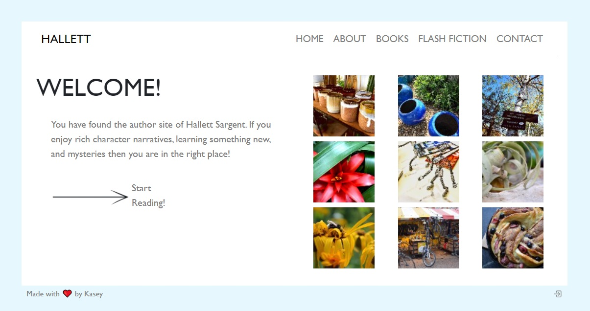
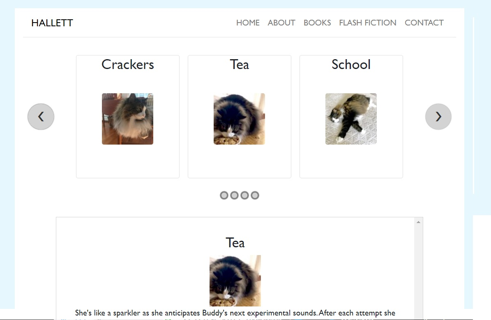

# Author Webpage: Hallett Sargent

## Description

Meet Hallett Sargent, an young novelist looking to share her love of storytelling with the world! Read her stories, read about her background, and leave a message.

## Table of Contents

- [Appearance](#appearance)
- [Installation](#installation)
- [Usage](#usage)
- [License](#license)
- [Contributing](#contributing)
- [Questions](#questions)

## Appearance

## Installation

This is a React app that uses node and express. Using the command line at the root level, type "npm install" or "npm i" to start.

## Usage

Use the deployed app [here](https://proj3-author-website.herokuapp.com/)!

There are seeds for flash fiction stories and messages.

## License

This project is licensed with MIT.

## Contributing

Fork the repo, make changes, and push those changes using git.

## Questions

https://github.com/kcushing1

If you have any additional questions, please send an email to kasey.cushing@gmail.com
